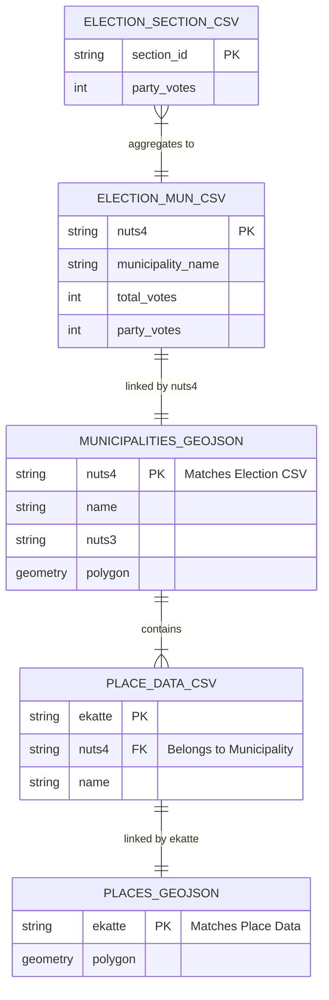

# Data Relationships & Schema Analysis

This document outlines the structure and relationships of the data files used in the Elections UI application.

## Directory Structure

- `public/assets/data/el_data/`: Contains election results (CSV).
- `public/assets/data/geo/`: Contains geographic data (GeoJSON, JSON, CSV).

## Data Schemas

### 1. Municipality Election Results (`*_mun.csv`)
**Path:** `public/assets/data/el_data/YYYY-MM-DDns_mun.csv`
**Granularity:** Aggregated votes per municipality.

| Column | Description | Key / Link |
|---|---|---|
| `municipality_name` | Name of the municipality (Cyrillic) | |
| `nuts4` | **Primary Key** for municipality (e.g., `VAR01`) | Links to `municipalities.json` |
| `region` | Region ID (MIR) | |
| `[Party Names]` | Vote counts for each party | |
| `total`, `total_valid` | Aggregate statistics | |

### 2. Section Election Results (`*.csv`)
**Path:** `public/assets/data/el_data/YYYY-MM-DDns.csv`
**Granularity:** Votes per voting section (poll station).

| Column | Description | Key / Link |
|---|---|---|
| `id` | Section ID (usually 9 digits) | Can be parsed to infer Region/Municipality |
| `[Party Names]` | Vote counts for each party | |

### 3. Municipalities Geometry (`municipalities.json`)
**Path:** `public/assets/data/geo/municipalities.json`
**Format:** GeoJSON FeatureCollection.

**Properties:**
- `nuts4`: **Foreign Key** matching `*_mun.csv`.
- `name`: Municipality name.
- `nuts3`: Region/District code (e.g., `VAR`).

### 4. Places/Settlements (`places.geojson` & `place_data.csv`)
**Path:** `public/assets/data/geo/places.geojson` (Geometry)
**Path:** `public/assets/data/geo/place_data.csv` (Metadata)

**Schema:**
- `ekatte`: Unique 5-digit code for the settlement.
- `nuts4`: Links the settlement to its parent municipality.
- `населено место`: Name of the settlement.

## Entity Relationship Diagram

## Key Findings

1.  **The `nuts4` code is the critical link.** It connects the election data (`*_mun.csv`) with the map polygons (`municipalities.json`) and the settlements list (`place_data.csv`).
2.  **Settlement Hierarchy:** Individual towns/villages (`places.geojson`) are linked to their municipalities via the `place_data.csv` file, which contains the `nuts4` code for each `ekatte`.
3.  **Data Flow:**
    - To visualize results on the map: Join `*_mun.csv` with `municipalities.json` on `nuts4`.
    - To search for a village and find its municipality: Search `place_data.csv` (or derived `places.json`), find `nuts4`, and then look up the municipality.
